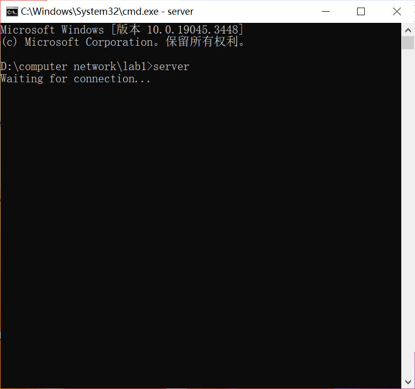
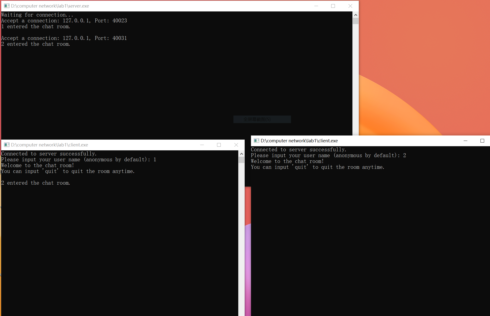
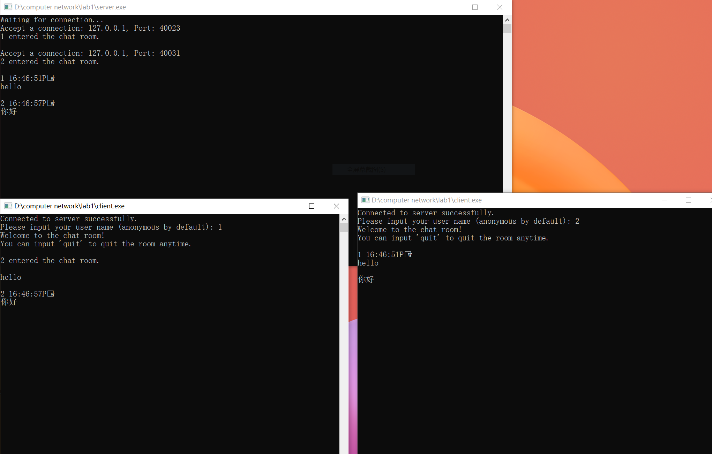
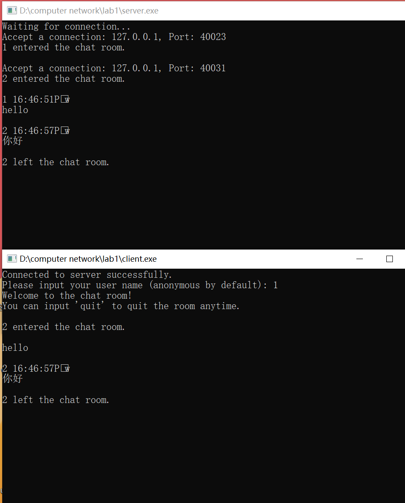

# Lab1: Messaging protocol using Socket

1. 给出聊天协议的完整说明；
2. 利用 C/C++，使用基本的Socket函数完成程序，不使用 CSocket 等封装后的类；
3. 使用流式套接字、采用多线程（或多进程）方式；
4. 有基本的对话界面和正常的退出方式；
5. 支持多人聊天，支持英文和中文聊天；
6. 结构清晰、可读；
7. 观察是否有数据丢失，提交程序源码和实验报告。

## Protocol Design

- TCP 传输协议，流式套接字，多线程
- 一个 server，多个 client
  - 先启动 server 绑定 IP 和端口
  - 再启动一个或多个（设置了最大连接数 clientMAX=5） client 连接 server，进行多线程通信
  - client 连接和退出时都打印消息
- client 和 server 通过 send 和 recv 函数进行消息收发
- 消息类型是 char 数组
  - 设置了最大发送和接收缓冲区大小 buffer_sz = 1024，超过的部分无法传输
  - 使用 getline 获取用户输入
  - client 连接后立刻获取用户名发给 server，后者将其存储在用户信息中，这样就不用在通信时标注
  - client 将用户输入加上时间戳 header 封装成消息发送，server 收到后改写成标识时间、用户、原始消息的输出格式转发给其他 client，后者收到后可以直接打印在屏幕上
  - 设定用户输入 quit 即可退出连接，同时把该消息发送给所有主机
- 编写头文件进行 WinSock2 库初始化，无需在 client 和 server 中单独实现

## Server

- 建立 Socket，绑定 IP 和端口，开始监听，等待连接请求
- 维护一个 clientSocket 数组存储各个 client 的套接字，一个结构体 client_info 数组对应存储 client 信息
- 每个 client 连接后为其创建一个独立的线程接收其信息
- 接收 client 发来的信息后，进行格式改写，转发给所有其他 client；如果收到的是 quit 消息，关闭对应的 clientSocket

实现代码：

1. Socket、端口、缓冲区、线程等定义：

```c++
int ServerPort = 1234; //端口号
const int buffer_sz = 1024;  //缓冲区大小
const int listenMAX = 5; //最大连接数
int connectedclient = 0; //当前连接数

SOCKET ServerSocket;
SOCKET ClientSockets[listenMAX]; 
sockaddr_in ServerAddr;
sockaddr_in ClientAddr[listenMAX];
int addr_len = sizeof(ClientAddr);
HANDLE ClientThreads[listenMAX]; //client 线程数组

char sendbuf[buffer_sz]; // 发送缓冲区
char recvbuf[buffer_sz]; // 接收缓冲区

struct clientinfo{
    int id;
    char user_name[128];
};
clientinfo Client_info[listenMAX]; // client 信息数组
```

2. main 函数完成绑定和连接

```c++
int main()
{
		//创建 Socket
    ServerSocket = socket(AF_INET, SOCK_STREAM, IPPROTO_TCP);
    if(ServerSocket == INVALID_SOCKET){
        cout<<"ServerSocket is invalid."<<endl;
        return -1;
    }
  
  	// 绑定
    ServerAddr.sin_family = AF_INET;
    ServerAddr.sin_port = htons(ServerPort);
    ServerAddr.sin_addr.S_un.S_addr = INADDR_ANY;
    if(bind(ServerSocket, (LPSOCKADDR)&ServerAddr, sizeof(ServerAddr)) == SOCKET_ERROR){
        cout<<"Bind failed."<<endl;
        return -1;
    }
  
  	//开始监听
    if(listen(ServerSocket, listenMAX) == SOCKET_ERROR){
        cout<<"Listen failed."<<endl;
        return -1;
    } else cout<<"Waiting for connection..."<<endl;

    while(1){ // 循环接收 client 的连接请求
        int i=0;
        for(;i<listenMAX;i++){
            if(ClientSockets[i]==0)
                break;
        }
        if(i>=listenMAX) continue;
        ClientSockets[i] = accept(ServerSocket, (SOCKADDR*)&ClientAddr[i], &addr_len);
        if(ClientSockets[i] == INVALID_SOCKET){
            cout<<"Connect failed."<<endl;
        }
        else{
            connectedclient++;
            Client_info[i].id = i;
            cout<<"Accept a connection: "<<inet_ntoa(ClientAddr[i].sin_addr)<<", Port: "<<htons(ClientAddr[i].sin_port)<<endl;
            memset(recvbuf, 0, buffer_sz);
          	// 接收第一条消息，是用户名
            recv(ClientSockets[i], recvbuf, buffer_sz, 0);
            int idx = 0;
          	// 用户名写入 client_info 中
            while(recvbuf[idx]!='\0'){
                Client_info[i].user_name[idx] = recvbuf[idx];
                idx++;
            }
            recvbuf[idx] = '\0';
          	// 创建线程
            ClientThreads[i] = CreateThread(NULL, NULL, recv_message, &Client_info[i], 0, NULL);
            if(ClientThreads[i] == 0){
                cout<<"Create client thread failed."<<endl;
                connectedclient--;
                return -1;
            }
          	// 将连接消息广播给所有人
            memset(sendbuf, 0, buffer_sz);
            strcat(sendbuf, Client_info[i].user_name);
            strcat(sendbuf, " entered the chat room.");
            cout<<sendbuf<<endl<<endl;
            for(int j=0; j<listenMAX;j++){
                if(j==i || ClientSockets[j]==INVALID_SOCKET)
                    continue;
                else send(ClientSockets[j], sendbuf, buffer_sz, 0);
            }
            if(connectedclient==listenMAX) cout<<"Connection is full."<<endl;
        }
    }
  
}
```

1. 接收并转发 client 消息的线程函数

```c++
DWORD WINAPI recv_message(LPVOID para){
  	// 通过 client_info 参数拿到当前的 clientSocket 索引和用户名
    clientinfo* client = (clientinfo*) para;
    int client_id = client->id;
    char client_name[128];
    strcpy(client_name, client->user_name);
    while(1){
        int len_recv = recv(ClientSockets[client_id], recvbuf, buffer_sz, 0);
        if(len_recv > 0){
          	// 用户退出，将消息广播给所有人
            if(recvbuf[0]=='q' && recvbuf[1]=='u' && recvbuf[2]=='i' && recvbuf[3]=='t'){ 
                memset(sendbuf, 0, buffer_sz);
                strcat(sendbuf, client_name);
                strcat(sendbuf, " left the chat room.");
                cout<<sendbuf<<endl<<endl;
                connectedclient--;
                for(int i=0; i<listenMAX;i++){
                    if(i==client_id || ClientSockets[i]==INVALID_SOCKET)
                        continue;
                    else send(ClientSockets[i], sendbuf, buffer_sz, 0);
                }
              	// 关闭对应的 clientSocket 连接
                closesocket(ClientSockets[client_id]);
                break;
            }
            else{
              	// 拆解接收到的消息
                char* timestr = (char*)malloc(8*sizeof(char));
                int idx = 0;
                for(; idx < 8; idx++){
                    timestr[idx] = recvbuf[idx];
                }
                char content[buffer_sz];
                int idx2 = 0;
                while(recvbuf[idx]!='\0'){
                    content[idx2] = recvbuf[idx];
                    idx++; idx2++;
                }
                content[idx2] = '\0';
              	// 将用户名、时间戳、原始消息封装成特定格式，广播
                memset(sendbuf, 0, buffer_sz);
                strcat(sendbuf, client_name); 
                strcat(sendbuf, " ");
                strcat(sendbuf, timestr); 
                strcat(sendbuf, "\n");
                strcat(sendbuf, content); 
                cout<<sendbuf<<endl<<endl;
                for(int i=0; i<listenMAX;i++){
                    if(i==client_id || ClientSockets[i]==INVALID_SOCKET)
                        continue;
                    else send(ClientSockets[i], sendbuf, buffer_sz, 0);
                }
            }
        }
    }
  	
  	closesocket(ServerSocket);
    return 0;
}

```

## Client

- 建立 Socket，连接到 server 的 IP 和端口
- 创建一个独立线程 recv 接收 server 转发的消息，打印在屏幕上
- 在终端输入消息，封装上时间戳，发送给 server
- 输入 quit，会将其直接发给 server 后退出连接

一开始使用两个 while 持续进行消息的 recv 和 send，直到用户退出为止；但立刻发现这样只能选择在 recv 结束后 send 或者反之，所以改成选择使用一个 while 发送消息，再创建一个 recv 接受消息线程。

实现代码：

1. main 函数完成绑定、连接、获取用户名、循环发送消息

```c++
int main()
{
  	// 创建 Socket
    LocalSocket = socket(AF_INET, SOCK_STREAM, IPPROTO_TCP);
    if(LocalSocket == INVALID_SOCKET){
        cout<<"LocalSocket is invalid."<<endl;
        return -1;
    }
  	// 绑定 server 地址
    RemoteAddr.sin_family = AF_INET;
    RemoteAddr.sin_port = htons(ServerPort);
    RemoteAddr.sin_addr.S_un.S_addr = inet_addr("127.0.0.1");

  	// 连接 server
    if(connect(LocalSocket, (sockaddr*)&RemoteAddr, addr_len)== -1){
        cout<<"Connect to server failed."<<endl;
        return -1;
    }
    cout<<"Connected to server successfully."<<endl;
  	// 创建线程
    RecvThread = CreateThread(NULL, NULL, recv_message, NULL, 0, NULL);
    if(RecvThread == 0){
        cout<<"Create client receive thread failed."<<endl;
        return -1;
    }
    
  	// 首先获取用户名，发给 server
    cout<<"Please input your user name (anonymous by default): ";
    char user_name[buffer_sz];
    cin.getline(user_name, buffer_sz);
    memset(sendbuf, 0, buffer_sz);
    if(strlen(user_name)!=0)
        strcat(sendbuf, user_name);
    else strcat(sendbuf, "anonymous");
    send(LocalSocket, sendbuf, buffer_sz, 0);
    cout<<"Welcome to the chat room! "<<endl;
    cout<<"You can input 'quit' to quit the room anytime."<<endl<<endl;

    while(1){ // 开始循环发送消息
        memset(input, 0, buffer_sz);
        cin.getline(input, buffer_sz);
        cout<<endl;
      	// 输入是 quit，直接发给 server，关闭连接
        if(strcmp(input, "quit")==0){
            send(LocalSocket, input, buffer_sz, 0);
            cout<<"bye."<<endl;
            closesocket(LocalSocket);
            return 0;
        }
        else{
          	// 封装上时间戳，发给 server
            memset(sendbuf, 0, buffer_sz);
            char* now = current_time();
            strcat(sendbuf, now);
            strcat(sendbuf, input);
            send(LocalSocket, sendbuf, buffer_sz, 0);
        }
    }
    
    return 0;
}
```

2. 获取时间戳、转为固定格式的函数 current_time

```c++
char* current_time(){
    time_t now = time(nullptr);
    tm* t = localtime(&now);
    string hour = to_string(t->tm_hour);
    if (hour.size() < 2) hour = "0" + hour;
    string minute = to_string(t->tm_min);
    if (minute.size() < 2) minute = "0" + minute;
    string second = to_string(t->tm_sec);
    if (second.size() < 2) second = "0" + second;
    string tmp = hour + ":" + minute + ":" + second;
    char* res = (char*)tmp.data();
    return res;
}
```

3. 接收消息并打印的线程函数

```c++
DWORD WINAPI recv_message(LPVOID){
  	// 循环接收 server 转发的消息，因为 server 已经统一封装成了可以直接打印的格式，可以无需处理直接打印在屏幕
    while(1){
        int len_recv = recv(LocalSocket, recvbuf, buffer_sz, 0);
        if(len_recv > 0){
            cout<<recvbuf<<endl<<endl;
            memset(recvbuf, 0, buffer_sz);
        }
    }
}
```

## Usage and Effect

1. 启动 server.exe



2. 连接 client，以两个为例



3. 发送消息，显示在所有主机的屏幕上，支持中英文



4. client 退出

