# Lab2: Web server configuration

1. 搭建 Web 服务器（自由选择系统），并制作简单的 Web 页面，包含简单文本信息（至少包含专业、学号、姓名）、自己的 LOGO、自我介绍的音频信息；
2. 通过浏览器获取自己编写的 Web 页面，使用 Wireshark 捕获浏览器与 Web 服务器的交互过程，使用 Wireshark 过滤器使其仅显示 HTTP 协议，进行简单的分析说明；
3. 使用 HTTP，不使用 HTTPS；
4. 提交 HTML 文档、捕获文件和实验报告。

---

## 制作 Web 页面

编写 test.html 文件如下：

```html
<!DOCTYPE html>
<html lang="en">
<head>
    <meta charset="UTF-8">
    <title>my info</title>
    <link rel="shortcut icon" href="#"/>
</head>
<body>
    <h1>hello world</h1>
    <div>
        <p>姓名：</p>
        <p>学号：</p>
        <p>专业：</p>
    </div>
    
    <audio src="{{url_for('static', filename='audio.mp3')}}" controls></audio>
</body>
</html>
```

引用 LOGO 图片和音频等静态资源时，由于后面搭建服务器采用的是 python 下的 flask 框架，因此使用了它提供的 `url_for()` 函数生成 URL 路径。

## 搭建服务器

编写 `app.py` 如下：

```python
from flask import Flask, render_template
app = Flask(__name__)

@app.route('/test', methods=['GET'])
def test():
    return render_template('test.html')

if __name__=="__main__":
    app.run(debug=True, port=5000)
```

执行该程序时，flask 会使用内置的开发服务器运行；代码中定义 URL 规则 `/test`，方法为 GET，并显式指定监听本地的 5000 端口，即浏览器访问地址 `http://127.0.0.1:5000/test` 时，服务器会调用函数 `test()` 渲染并返回刚才编写的 test.html 页面。

启动程序，在浏览器访问地址，看到页面如下图：

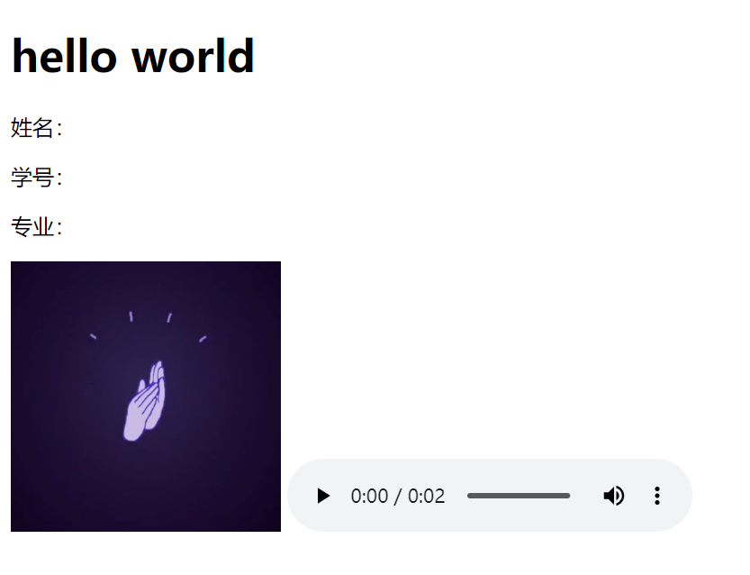

## Wireshark 捕获分析

打开 Wireshark，由于是本地回环地址 127.0.0.1 抓包，使用 Adapter for loopback traffic capture，设置过滤端口为 5000（`tcp.port == 5000`），用浏览器访问 `http://127.0.0.1:5000/test` 进行捕获，关闭网页，得到捕获结果如下：

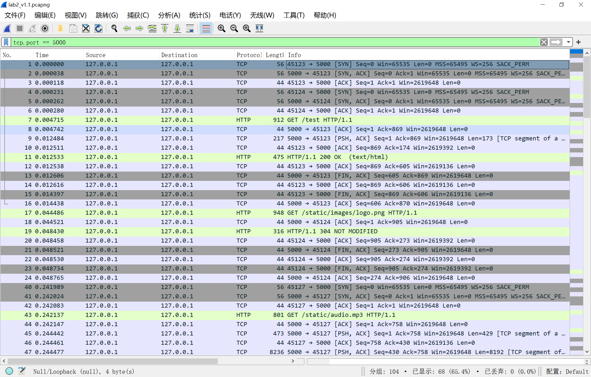

浏览器（客户端）和 Web 服务器的交互过程主要分几步：

1. 客户端和服务器通过 TCP 三次握手，建立连接；
2. 客户端向服务器发送 HTTP 请求，服务器接受请求，返回响应；
3. 客户端和服务器通过 TCP 四次挥手，断开连接。

下面将分别分析这几个步骤。

### TCP 三次握手

从网页打开到关闭，一共有四个端口（45123/45124/45127/45130）和 5000 端口同时交互，因此出现了四组 TCP 三次握手和四次挥手，这里仅分析 45123 端口的握手过程，下面四次挥手同。

筛选后的通过 5000 端口的前三条报文就代表了 TCP 三次握手：

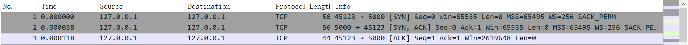

以第一次握手为例，可以看到 TCP 报文由四个部分组成（前三个部分仅在此分析一次，接下来分析的都是数据段）：

1. 物理层数据帧概况

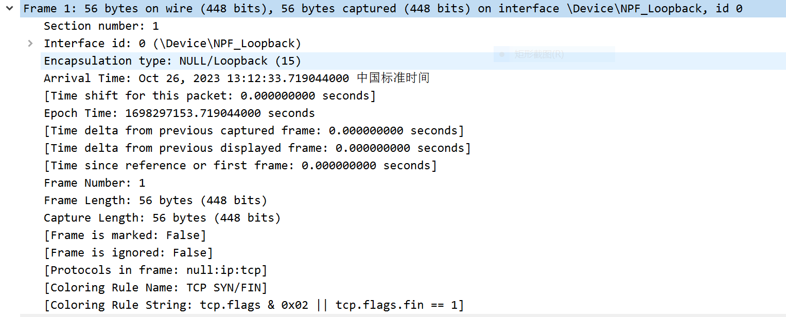

2. 数据层头部信息（本地回环，基本可以省略）
3. 网络层 IP 包 header 信息

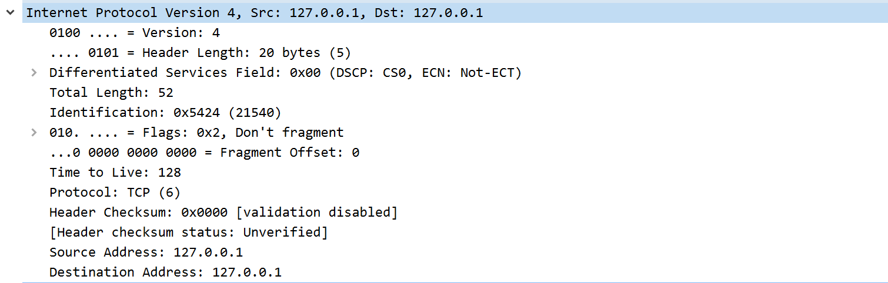

- IPv4 协议
- header 总长度 52
- 标识字段 21540
- 生存期 128
- 上层协议 TCP
- 校验和
- 源 IP 地址 127.0.0.1、目的 IP 地址 127.0.0.1

4. 数据段信息

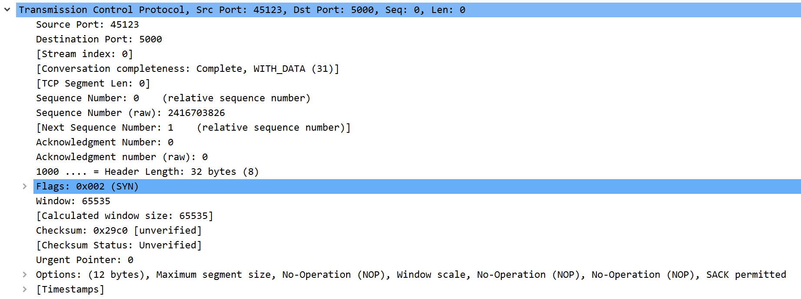

- 源端口 45123、目的端口 5000
- （相对）发送序号 Sequence Number = 0
- Acknowledgement = 0
- flag：SYN

一、第一次握手

如前文，客户端主动向服务器发送 SYN 报文，表示请求建立新连接，发送初始序号 Seq=0，随后进入 SYN-SENT 同步已发送状态。

二、第二次握手

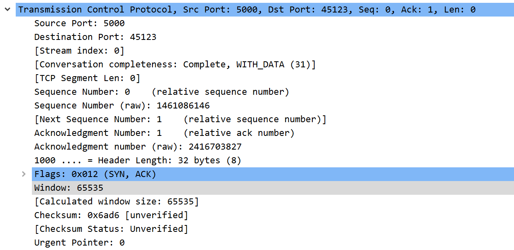

标志位为 SYN 和 ACK，表示服务器同意创建新连接，并且确认客户端的序号有效，可以正常接收上一条报文的数据；发送自己的初始序号 Seq=0，确认号为接收到的客户端序号 + 1（即 Ack = Seq+1=1），随后进入 SYN-RCVD 同步收到状态。

三、第三次握手

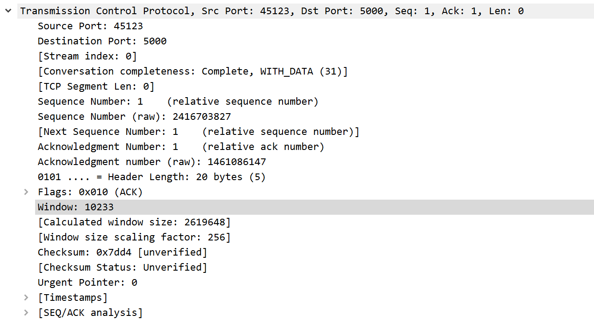

标志位为 ACK，表示客户端确认可以收到服务器的数据，序号 Seq=1，确认号 Ack=1，双方确认 TCP 连接建立完毕，客户端和服务器都进入了 ESTABLISHMENT 状态。

### HTTP 请求交互

#### HTTP 请求报文

连接建立完毕后，客户端就向服务器发送 HTTP 请求，报文格式在原有基础上，增加了超文本传输协议部分。

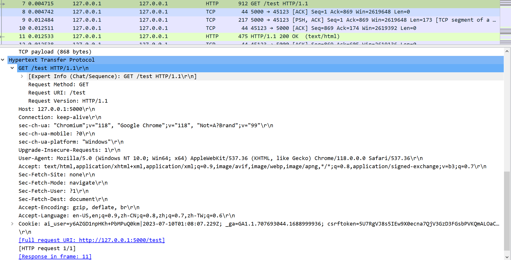

- TCP 数据段长度 868（因为封装了 HTTP 报文数据；下一个 Seq = 1+868=869）
- flag：PSH 和 ACK（PSH 表示接收方应该立刻将缓冲区数据推送给应用进程）
- 请求方法 GET
- URL `/test`，最下面还写了完整的 URL `http://127.0.0.1:5000/test`
- HTTP 版本 HTTP/1.1（一个连接内多个 HTTP 请求可以并行）
- Host 127.0.0.1:5000
- 连接类型 keep-alive（该连接可以复用）
- User Agent Mozilla/5.0（浏览器类型）

另外，在最下面还写明了响应该请求的物理帧号。

#### HTTP 响应报文

服务器发给客户端的 HTTP 响应报文在请求报文的基础上又增加了数据段，返回了客户端请求的 html 页面。

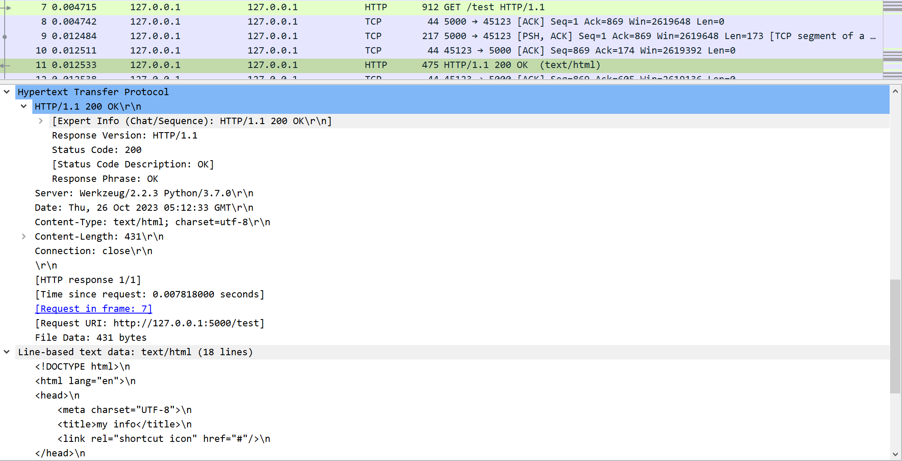

响应报文在超文本协议部分还包含了一个状态码，如上图第一次请求 html 页面成功时，显示状态码为 200，表示请求成功。

在请求 logo.png 时会显示状态码 304 Not Modified，因为此前已经访问过该网页的图片，客户端已经将其存在了缓存里，304 就表示客户端缓存的资源未被修改过，服务器不会返回任何资源。

在请求 audio.mp3 时会显示状态码 206 Partial Content，因为视频/音频文件如果全部下载下来再播放，会让用户等待很长时间，所以服务器允许客户端使用 range 头请求视频的某一部分，使客户端可以边播放边请求，206 就表示请求部分内容成功。

请求数据比较大的时候，会将返回的数据切分为多个 TCP 数据包，分别附在多段报文中返回，最后在一条 HTTP 响应报文里重新组装；这个过程在请求音频文件时体现得比较明显，如下：

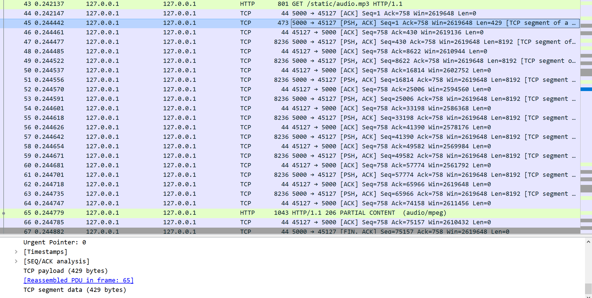

在服务器连续发送的这些报文中，都可以看到如图最下方的 [Reassembled PDU in frame: 65] 标签，表示这是一条完整的 TCP 报文中的一段，在物理帧 65（即 HTTP 响应报文）重组，并写明了本段包含的数据长度为（以首段为例） 429 个字节。

在最终的 HTTP 响应报文中，也可以看到组成这条报文的所有段的物理帧，以及每一段包含了多少数据：

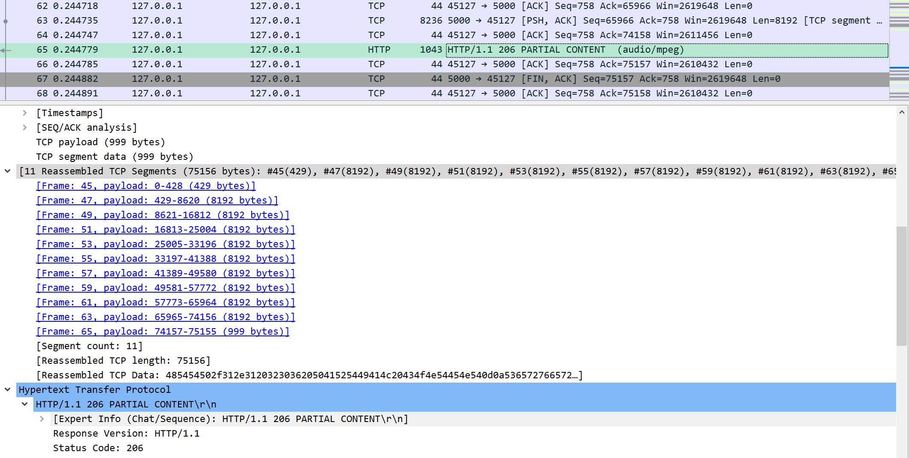

### TCP 四次挥手

HTTP 交互完毕后，服务器和客户端通过 TCP 四次挥手断开连接。

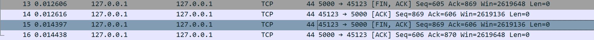

一、第一次挥手

客户端首先向服务器发送 FIN 报文，指定序列号 Seq=i，主动关闭 TCP 连接，进入 FIN_WAIT_1 终止等待1 状态。

二、第二次握手

服务器收到来自客户端的 FIN 报文后，发送 ACK 报文，确认号为客户端 FIN 报文的序列号+1（Ack=i+1），进入 CLOSE_WAIT 关闭等待状态；此时，客户端到服务器的连接已经释放，客户端收到这条 ACK 报文后，进入 FIN_WAIT_2 终止等待2 状态。

三、第三次握手

服务器再向客户端发送 FIN 报文，进入 LAST_ACK 最后确认状态，等待客户端的确认。

四、第四次挥手

客户端收到来自服务器的 FIN 报文后，发送 ACK 报文，进入 TIME_WAIT 时间等待状态；但此时 TCP 连接尚未终止，要等待 2msl （最长报文寿命），保证这个 ACK 报文到达服务器、后者立刻进入 CLOSED 关闭状态后，客户端才会进入 CLOSED 关闭状态，四次挥手完成，TCP 连接关闭。