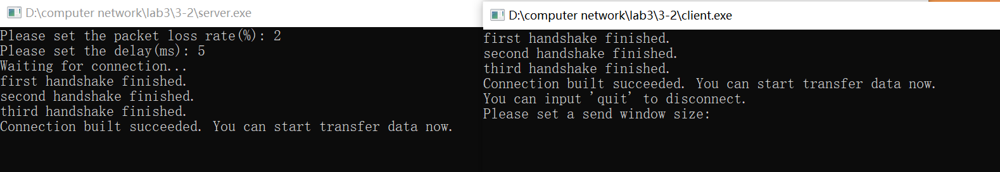

# Lab3-2: UDP reliable service - GBN

在实验3-1（建立连接、差错检测、接收确认、超时重传）的基础上，将停等机制改成基于滑动窗口的流量控制机制，发送窗口和接收窗口采用相同大小，支持**累积确认**，完成给定测试文件的传输。

## Protocol Design

- 一个 server，一个 client
- 三次握手和四次挥手建立和结束连接
- 单项数据传输：client 发送数据，server 返回确认
  - 滑动窗口
    - 发送窗口为 n（用户自行输入），client 可以发出 n 个未得到确认的 packet
    - client 每收到一个 ack，就把窗口往前移动
  - 差错检测
  - 接收确认
  - 超时重传
    - 如果 server 收到了乱序的 packet，就把最后一个确认的 ack 重传
    - client 忽视收到的重复 ack；如果一定时间内没有收到新的 ack，就重传所有未被确认的 packet

## Packet

在头文件 `udp.h` 中实现，主要包括了 header 和 packet 的数据结构，还有一些操作函数：  

header 的成员有 packet **数据部分**的长度 `datasize`，校验和 `sum`，属性标志 `flag`，序列号 `seq` 和响应号 `ack`。  
其中，flag 包含的属性有：`END, START, OVER, FIN, ACK, SYN`，`SYN` 和 `FIN` 分别用于建立和关闭连接，`ACK` 表示响应，`START` 和 `OVER` 表示一个文件的开始和结束，`END` 表示数据传输完毕。  
另外，定义了 header 的初始化和赋值函数，以及查询 flag 是否**包含**某个字段的函数。

```c++
class Header
{
public:
    uint16_t datasize = 0;
    uint16_t sum = 0;
    uint16_t flag = 0; // END START OVER FIN ACK SYN
    uint16_t ack = 0;
    uint16_t seq = 0;
    Header(){}
    Header(uint16_t datasize, uint16_t sum, uint16_t flag, uint16_t ack, uint16_t seq) : datasize(datasize),sum(sum),flag(flag),ack(ack),seq(seq){}
    void set(uint16_t datasize, uint16_t sum, uint16_t flag, uint16_t ack, uint16_t seq);
    bool isSYN();
    bool isACK();
    bool isFIN();
    bool isOVER();
    bool isSTART();
    bool isEND();
};
```

packet 的成员有 header 和一个存储数据的字符数组，定义其长度为 `MAX_LENGTH`= 4KB。  
定义了 packet 的初始化和赋值函数。

```c++
class Packet
{
public:
    Header header;
    char buffer[MAX_LENGTH] = "";
    Packet(){}
    Packet(Header& header) : header(header){}
    void set(Header& _header, char* data_segment, int size){
        header = _header;
        memcpy(buffer, data_segment, size);
    }
};
```

最后，定义了两个函数：  
计算校验和的函数 `check_sum`；对已有校验和的包，它还可以通过检查计算结果是否为 0 确认校验和的正确性；  

```c++
uint16_t check_sum(uint16_t* pa, int size){
    int count = (size+1)/2;
    uint16_t* buf = (uint16_t*)malloc(size);
    memset(buf, 0, size);
    memcpy(buf, pa, size);
    unsigned long sum = 0;
    while(count--){
        sum += *buf++;
        if (sum & 0xffff0000) {
            sum &= 0xffff;
            sum++;
        }
    }
    return ~(sum & 0xffff);
}
```

打印 packet 信息的函数 `print_log`。

## Connect & Disconnect

通过三次握手和四次挥手完成连接，分别在 server 和 client 中实现：  


- 第一次握手：client 将 packet 标志位置为 `SYN`，seq=0xFFFF(-1)，发送给 server；
- 第二次握手：server 将标志位置为 `SYN` 和 `ACK`，seq=0xFFFF，ack=0，发送给 client；
- 第三次握手：client 将标志位置为 `ACK`，seq=0，ack=0，发送给 server。


- 第一次挥手：client 将 packet 标志位置为 `FIN`，seq=0xFFFF(-1)，发送给 server；
- 第二次挥手：server 将标志位置为 `ACK`，seq=0，ack=0，发送给 client；
- 第三次挥手，server 将标志位置为 `FIN` 和 `ACK`，seq=0xFFFF(-1)，发送给 client；
- 第四次握手，client 将标志位置为 `ACK`，seq=0，ack=0，发送给 server。

具体实现上，主要问题在阻塞：因为建立和关闭连接时都是 client 先发起，server 起初需要先在一个 while 循环里不断接收消息，直到接收了 client 发来的信息，才能往下执行；另外，在接收带有 `ACK` 字段的响应信息时，都要设置超时重传。

```c++
bool Connect()
{
    // 以建立连接的第一次握手为例，server 需要循环接收消息
    while(1){
        res = recvfrom(ServerSocket, connect_buf, packet_length, 0, (SOCKADDR*)&ClientAddr, &ClientAddrSize);
        if(res == SOCKET_ERROR){
            cout<<"first handshake failed."<<endl;
            return 0;
        }
        memcpy(&connect, connect_buf, packet_length);
        if((connect.header.flag == SYN) && (connect.header.seq == 0xFFFF) && check_sum((uint16_t*)&connect, packet_length)==0){
            cout<<"first handshake finished."<<endl;
            break;
        }
    }
    //other codes
    clock_t start = clock(); // 发送第二次握手后记录时间
    // 同样以此处的第三次握手为例，接收的是对第二次握手的响应
    while(recvfrom(ServerSocket, connect_buf, packet_length, 0, (SOCKADDR*)&ClientAddr, &ClientAddrSize)<=0){
        if(clock()-start > Max_time){ // 设定超时重传
            cout<<"second handshake timed out. Resending..."<<endl;
            res = sendto(ServerSocket, connect_buf, packet_length, 0, (SOCKADDR*)&ClientAddr, ClientAddrSize);
            if(res == SOCKET_ERROR){
                cout<<"second handshake failed."<<endl;
                return 0;
            }
            start = clock(); // 重置时间
        }
    }
    cout<<"second handshake finished."<<endl; // 接收到第三次握手后，第二次握手才能确定完成
    //other codes
}
```

## Client

client 从建立到关闭的整个流程如下：

1. 建立 socket，绑定端口和 IP；
2. 进入 `Connect` 函数，三次握手建立连接；
3. 用户输入发送窗口大小、丢包率和延迟；
4. 开始数据传输：
   1. 用户输入文件名；
      - 如果是 quit 指令，就发送一个 `flag` 为 `END` 的包给 server 告知对方传输结束，跳出；
      - 如果是文件名，就进入下一步；
   2. 进入`multithread_GBN` 函数，发送文件；
   3. 记录发送文件前后的时间，打印传输用时和平均吞吐率；
   4. 循环上述步骤。
5. 进入 `Disconnect` 函数，四次挥手关闭连接；
6. 关闭 socket，打印退出消息，结束。

其中，连接的建立和关闭在上文已经阐述过，这里只说明发送文件的过程。

本次实验将流量控制机制从 3-1 中的停等改成了滑动窗口，窗口随着发送进行在序列号空间向前移动；假设滑动窗口大小为 `cwnd = n`，那么 client 可以一口气发送 n 个 packet，而无需等到 server 的确认。  
server 每收到一个正确的 packet（此处有差错检测），就返回一个 ack；client 收到 ack 后，就把窗口往前移动。  

为了实现并行的发送和接收，在 `multithread_GBN` 中创建两个线程，分别实现发送函数 `send_file` 和接收函数 `recv_ack`：

```c++
void multithread_GBN(string filename)
{
    last_ack = 0;
    nxt = 1;

    // other code

    HANDLE GBN_threads[2];
    GBN_threads[0] = CreateThread(NULL, NULL, send_file, &filename, 0, NULL);
    GBN_threads[1] = CreateThread(NULL, NULL, recv_ack, NULL, 0, NULL);

    WaitForMultipleObjects(2, GBN_threads, true, INFINITE);
    CloseHandle(GBN_threads[0]);
    CloseHandle(GBN_threads[1]);
}
```

发送函数 `send_file` 中，首先发送带有 `START` 字段、内容是文件名的第一个 packet，然后将文件拆成若干个 packet 顺序发送出去，最后一个要加上 `OVER` 字段。  

为了实现滑动窗口机制，新定义两个变量 `last_ack` 和 `nxt`，前者是收到的最后一个ack，即发送窗口的左边界；后者是下一个要发送的 packet 的序列号；而右边界可以由左边界加窗口长度得到，即 `last_ack + cwnd -1`，这三者构成了发送窗口。  
收到最后一个 ack 之后，发送过程才宣告结束，设置循环条件为 `last_ack <= packet_num`；判定下一个发送的 packet 是否在窗口里，是则发送。  

函数主体如下：

```c++
DWORD WINAPI send_file(LPVOID para)
{
    // prev code，已经发送完第一个内容是文件名的 packet
    start = clock();
    char* file_pos = file_buf;
    while(last_ack <= packet_num){ // 还没有收到所有ack
        if(nxt <= packet_num && nxt <= last_ack + cwnd - 1){
            if(nxt == packet_num){ // 最后一个包，要标记OVER，另外注意包的大小
                send_header.set(filesz - (nxt-1)*MAX_LENGTH, 0, OVER, 0, nxt);
                send.set(send_header, file_pos, filesz - (nxt-1)*MAX_LENGTH);
                send.header.sum = check_sum((uint16_t*)&send, packet_length);
            }
            else {
                send_header.set(MAX_LENGTH, 0, 0, 0, nxt);
                send.set(send_header, file_pos, MAX_LENGTH);
                send.header.sum = check_sum((uint16_t*)&send, packet_length);
            }
            send_packet(send);
            nxt++;
            file_pos = file_buf + (nxt-1)*MAX_LENGTH;
        }
        
        if(resend){ // 超时重传
            cout<<"Timed out. resending..."<<endl;
            nxt = last_ack;
            file_pos = file_buf + (nxt-1)*MAX_LENGTH;
            cout<<"nxt = "<<last_ack<<endl<<endl;
            resend = false;
            start = clock();
        }
    }
}
```

上述循环内部除了发送，还设置了超时重传，即如果长时间没有收到新的 ack，就要重传所有已发送但没有确认的 packet，将下一个发送的指针挪到窗口左边界，`nxt = last_ack`。  
这里存在一个线程间的沟通：在接收函数 `recv_ack` 中，循环接收 server 发来的 ack，如果超过了设定的最大间隔 `Max_time` 还没有收到，就设定全局变量 `resend = true`，`send_file` 看到了这个变量变化，就进入超时重传。

为发送 packet 编写了单独的函数 `send_packet`；和实验 3-1 不同，不是停等机制，不需要等到收到 ack，发送完就退出。  

```c++
void send_packet(Packet& pa)
{
    char* send_buf = new char[packet_length];
    memcpy(send_buf, &pa, packet_length);    
    
    int res = sendto(ClientSocket, send_buf, packet_length, 0, (SOCKADDR*)&ServerAddr, ServerAddrSize);
    if(res == SOCKET_ERROR){
        cout<<"send error."<<endl;
    }
    cout<<"[Send]"<<endl;
    print_log(pa);
    seq_num++;
    
    delete[] send_buf;
}
```

`recv_ack` 除了给发送函数传递超时重传的信号外，主要工作就是在收到 ack 后将发送窗口向前滑动；采用累积确认，即无论丢失了多少个 ack，只要在超时之前收到了 server 返回的一个 ack，就一并确认前面所有的 packet，避免一系列 ack 中的某一个丢失造成的无必要的重传。  
具体实现上，就是使 `last_ack = recv.header.ack`。  

另外，由于在 server 接收检查出错时会返回之前的最后一个 ack，client 要无视重复 ack。

函数主体如下：

```c++
DWORD WINAPI recv_ack(LPVOID)
{
    int packet_num = filesz/MAX_LENGTH + 1;
    Packet recv;
    char* recv_buf = new char[packet_length];
    while(last_ack <= packet_num){
        while(recvfrom(ClientSocket, recv_buf, packet_length, 0, (SOCKADDR*)&ServerAddr, &ServerAddrSize)<=0){
            if(clock()-start > Max_time){ // 超时重发
                resend = true;
            }
        }
        start = clock();
        memcpy(&recv, recv_buf, packet_length);
        if(recv.header.flag == ACK && check_sum((uint16_t*)&recv, packet_length)==0){
            if(recv.header.ack >= last_ack+1){ // 收到正确的ack，窗口向前滑动
                //打印接收消息
                cout<<"[Recv]"<<endl;
                cout<<"seq: "<<recv.header.seq<<" ack: "<<recv.header.ack<<endl;
                last_ack = recv.header.ack;
                // 输出新的发送窗口
                cout<<"last ack = "<<last_ack<<endl;
                int right_border = last_ack + cwnd - 1 <= packet_num? last_ack + cwnd - 1 : packet_num;
                cout<<"send window: ["<<last_ack<<","<<right_border<<"]"<<endl<<endl;
            }
            else if (recv.header.ack == last_ack){ // 忽视重复的ack，只打印
                cout<<"repetitive ack: "<<recv.header.ack<<endl<<endl;
            }
        }
    }

    delete[] recv_buf;
}
```

## Server

server 从建立到关闭的整个流程和 client 基本一致，唯一区别是发送文件变为接收文件。  

用于接收单个文件的函数 `recv_file` 循环接收从 `START` 到 `OVER` 的所有 packet，每收到一个，首先检查检验和是否有误，有则直接丢弃，没有再根据 `flag` 字段分别处理；如果序列号有误，即收到了乱序的 packet，就重传之前发过的最后一个 ack。

对正确的 packet，给它发回对应的 ack，将其数据写入字符数组 `file_content` 里，最后再统一写入创建的文件中。  
为确定当前 packet 写入的位置，维护一个 `offset` 变量，每次增加所收到 packet 的数据长度，文件全部传输完毕后就得到了文件大小。  
另外，这里实现了随机丢包（丢掉 ack）和固定延迟。

函数主体如下：

```c++
void recv_file(){
    loss_num = 0;
    char* file_content = new char[Max_filesz];
    string filename = "";
    long offset = 0;
    int res;
    while(1){
        char* recv_buf = new char[packet_length];
        Packet recv;
        res = recvfrom(ServerSocket, recv_buf, packet_length, 0, (SOCKADDR*)&ClientAddr, &ClientAddrSize);
        if(res == SOCKET_ERROR){
            cout<<"recv error."<<endl;
        }else {
            memcpy(&recv, recv_buf, packet_length);
            // 检查检验和，若有错则直接将该数据包丢弃，等待对面超时重传
            if(check_sum((uint16_t*)&recv, packet_length)!=0){
                cout<<"This packet's check sum is wrong. waiting for resend."<<endl<<endl;
                continue;
            }
            // 第一个包，内容是文件名
            if(recv.header.isSTART() && recv.header.seq==0){
                filename = recv.buffer;
                //print info
                send_ack(recv.header.seq);
            }
            // client 结束连接
            else if(recv.header.isEND()){
                quit = true;
                cout<<"Preparing to quit..."<<endl;
                delete[] recv_buf;
                break;
            }
            // 传错了，就重传最后一个确认收到的 ack
            else if(recv.header.seq!=seq_num+1){
                //print info
                send_ack(seq_num);
                continue;
            }
            // 收到的是正确的包，随机丢包、固定延迟
            else 
            {
            int err = rand()%100;
            if(err<loss_rate) {
                loss_num++;
                // print info
                continue;
            }
            Sleep(delay);
            // 最后一个包，这个文件全部发送完毕
            if(recv.header.isOVER()){
                cout<<"offset = "<<offset<<endl;
                memcpy(file_content + offset, recv.buffer, recv.header.datasize);
                seq_num++;
                offset += recv.header.datasize;
                //print info
                send_ack(recv.header.seq);
                ofstream fout(output_dir + filename, ofstream::binary);
                fout.write(file_content, offset);
                fout.close();
                //print info
                delete[] recv_buf;
                break;
            }
            // 文件发送中
            else {
                seq_num++;
                memcpy(file_content + offset, recv.buffer, recv.header.datasize);
                //print info
                send_ack(recv.header.seq);
                offset += recv.header.datasize;
            }
            }
        }
        delete[] recv_buf;
    }
    
    seq_num = 0; // 每次收到一个文件，就把seq重置
    delete[] file_content;
}
```

定义发送 ack 的函数 `send_ack`，与实验 3-1 不同的是，因为有乱序重传的情况，将传入的参数从一个 packet 改为其序列号，这样在重传最后一个 ack 时只要将维护的 `seq_num` 变量传入即可，而不需要再创建一个 packet。

```c++
void send_ack(uint16_t recv_seq){
    Packet pa_ack;
    char* buf = new char[packet_length];
    pa_ack.header.set(0, 0, ACK, recv_seq+1, seq_num);
    pa_ack.header.sum = check_sum((uint16_t*)&pa_ack, packet_length);
    memcpy(buf, &pa_ack, packet_length);
    int res = sendto(ServerSocket, buf, packet_length, 0, (SOCKADDR*)&ClientAddr, ClientAddrSize);
    if(res == SOCKET_ERROR) cout<<"send ack failed."<<endl;
    else{
        cout<<"[Send]"<<endl;
        cout<<"seq: "<<pa_ack.header.seq<<" ack: "<<pa_ack.header.ack<<endl<<endl;
    }
    delete[] buf;
}
```

## Usage and Effect

首先打开 server，然后打开 client，建立连接：


设置滑动窗口大小为 5，尝试传输文件，查看传输时间和吞吐率：


测试滑动窗口的超时重传，设置 2% 的丢包率和 5ms 延迟：




可以看到 server 打印了报错信息、重传了最后一个 ack，client 打印了超时信息、重传了所有已发送但未确认的 packet。

输入 quit 结束传输，关闭连接并退出：


测试传输文件 `1.jpg, 2.jpg, 3.jpg, helloworld.txt`，正确。丢包率和延迟都为 0、窗口大小为 5 的情况下，测试文件的吞吐率和时延如下：

| filename | 1.jpg | 2.jpg | 3.jpg | helloworld.txt |
| -------- | ----- | ----- | ----- | -------------- |
| time(s) | 0.951 | 2.839 | 5.654 | 0.798 |
| throughput(bytes/ms) | 1953.05 | 2077.67 | 2116.91 | 2080.16 |
