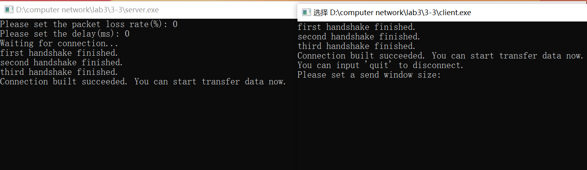
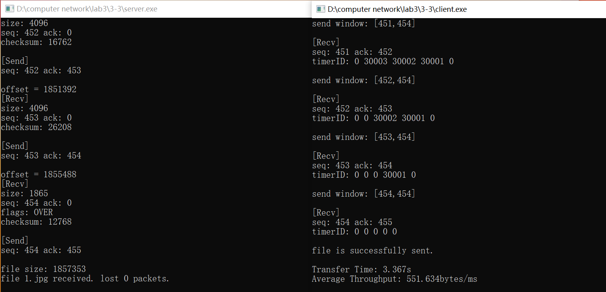
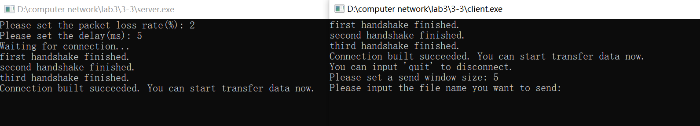
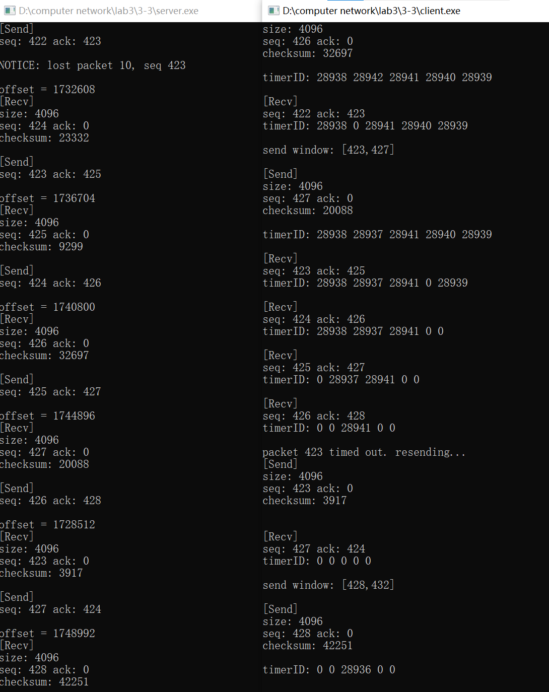
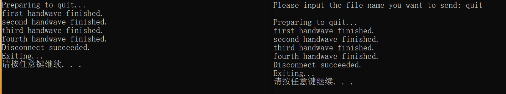

# Lab3-3: UDP reliable service - SR

在实验3-1的基础上，将停等机制改成基于滑动窗口的流量控制机制，发送窗口和接收窗口采用相同大小，支持**选择确认**，完成给定测试文件的传输。

## Protocol Design

- 一个 server，一个 client
- 三次握手和四次挥手建立和结束连接
- 单项数据传输：client 发送数据，server 返回确认
  - 滑动窗口
    - 发送窗口为 n（用户自行输入），client 可以发出 n 个未得到确认的 packet
    - client 每收到一个位于窗口最左端的 ack，就把窗口往前移动
  - 差错检测
  - 接收确认
  - 超时重传
    - 如果 server 处某个 packet 超时未收到确认，就重传

## Packet

在头文件 `udp.h` 中实现，主要包括了 header 和 packet 的数据结构，还有一些操作函数：  

header 的成员有 packet **数据部分**的长度 `datasize`，校验和 `sum`，属性标志 `flag`，序列号 `seq` ，响应号 `ack`；在此基础上，本次实验新加了表示文件长度（packet 数量）的 `len`。  
其中，flag 包含的属性有：`END, START, OVER, FIN, ACK, SYN`，`SYN` 和 `FIN` 分别用于建立和关闭连接，`ACK` 表示响应，`START` 和 `OVER` 表示一个文件的开始和结束，`END` 表示数据传输完毕。  
另外，定义了 header 的初始化和赋值函数，以及查询 flag 是否**包含**某个字段的函数。

```c++
class Header
{
public:
    uint16_t datasize = 0;
    uint16_t sum = 0;
    uint16_t flag = 0; // END START OVER FIN ACK SYN
    uint16_t ack = 0;
    uint16_t seq = 0;
    uint16_t len = 0;
    Header(){}
    Header(uint16_t datasize, uint16_t sum, uint16_t flag, uint16_t ack, uint16_t seq, uint16_t len=0) : datasize(datasize),sum(sum),flag(flag),ack(ack),seq(seq),len(len){}
    void set(uint16_t datasize, uint16_t sum, uint16_t flag, uint16_t ack, uint16_t seq, uint16_t len=0);
    bool isSYN();
    bool isACK();
    bool isFIN();
    bool isOVER();
    bool isSTART();
    bool isEND();
};
```

packet 的成员有 header 和一个存储数据的字符数组，定义其长度为 `MAX_LENGTH`= 4KB。  
定义了 packet 的初始化和赋值函数。

```c++
class Packet
{
public:
    Header header;
    char buffer[MAX_LENGTH] = "";
    Packet(){}
    Packet(Header& header) : header(header){}
    void set(Header& _header, char* data_segment, int size){
        header = _header;
        memcpy(buffer, data_segment, size);
    }
};
```

最后，定义了两个函数：  
计算校验和的函数 `check_sum`；对已有校验和的包，它还可以通过检查计算结果是否为 0 确认校验和的正确性；  

```c++
uint16_t check_sum(uint16_t* pa, int size){
    int count = (size+1)/2;
    uint16_t* buf = (uint16_t*)malloc(size);
    memset(buf, 0, size);
    memcpy(buf, pa, size);
    unsigned long sum = 0;
    while(count--){
        sum += *buf++;
        if (sum & 0xffff0000) {
            sum &= 0xffff;
            sum++;
        }
    }
    return ~(sum & 0xffff);
}
```

打印 packet 信息的函数 `print_log`。

## Connect & Disconnect

通过三次握手和四次挥手完成连接，分别在 server 和 client 中实现：  


- 第一次握手：client 将 packet 标志位置为 `SYN`，seq=0xFFFF(-1)，发送给 server；
- 第二次握手：server 将标志位置为 `SYN` 和 `ACK`，seq=0xFFFF，ack=0，发送给 client；
- 第三次握手：client 将标志位置为 `ACK`，seq=0，ack=0，发送给 server。


- 第一次挥手：client 将 packet 标志位置为 `FIN`，seq=0xFFFF(-1)，发送给 server；
- 第二次挥手：server 将标志位置为 `ACK`，seq=0，ack=0，发送给 client；
- 第三次挥手，server 将标志位置为 `FIN` 和 `ACK`，seq=0xFFFF(-1)，发送给 client；
- 第四次握手，client 将标志位置为 `ACK`，seq=0，ack=0，发送给 server。

具体实现上，主要问题在阻塞：因为建立和关闭连接时都是 client 先发起，server 起初需要先在一个 while 循环里不断接收消息，直到接收了 client 发来的信息，才能往下执行；另外，在接收带有 `ACK` 字段的响应信息时，都要设置超时重传。

```c++
bool Connect()
{
    // 以建立连接的第一次握手为例，server 需要循环接收消息
    while(1){
        res = recvfrom(ServerSocket, connect_buf, packet_length, 0, (SOCKADDR*)&ClientAddr, &ClientAddrSize);
        if(res == SOCKET_ERROR){
            cout<<"first handshake failed."<<endl;
            return 0;
        }
        memcpy(&connect, connect_buf, packet_length);
        if((connect.header.flag == SYN) && (connect.header.seq == 0xFFFF) && check_sum((uint16_t*)&connect, packet_length)==0){
            cout<<"first handshake finished."<<endl;
            break;
        }
    }
    //other codes
    clock_t start = clock(); // 发送第二次握手后记录时间
    // 同样以此处的第三次握手为例，接收的是对第二次握手的响应
    while(recvfrom(ServerSocket, connect_buf, packet_length, 0, (SOCKADDR*)&ClientAddr, &ClientAddrSize)<=0){
        if(clock()-start > Max_time){ // 设定超时重传
            cout<<"second handshake timed out. Resending..."<<endl;
            res = sendto(ServerSocket, connect_buf, packet_length, 0, (SOCKADDR*)&ClientAddr, ClientAddrSize);
            if(res == SOCKET_ERROR){
                cout<<"second handshake failed."<<endl;
                return 0;
            }
            start = clock(); // 重置时间
        }
    }
    cout<<"second handshake finished."<<endl; // 接收到第三次握手后，第二次握手才能确定完成
    //other codes
}
```

## Client

client 从建立到关闭的整个流程如下：

1. 建立 socket，绑定端口和 IP；
2. 进入 `Connect` 函数，三次握手建立连接；
3. 用户输入发送窗口大小、丢包率和延迟；
4. 开始数据传输：
   1. 用户输入文件名；
      - 如果是 quit 指令，就发送一个 `flag` 为 `END` 的包给 server 告知对方传输结束，跳出；
      - 如果是文件名，就进入下一步；
   2. 进入`multithread_SR` 函数，发送文件；
   3. 记录发送文件前后的时间，打印传输用时和平均吞吐率；
   4. 循环上述步骤。
5. 进入 `Disconnect` 函数，四次挥手关闭连接；
6. 关闭 socket，打印退出消息，结束。

其中，连接的建立和关闭在上文已经阐述过，这里只说明发送文件的过程。

本次实验将流量控制机制仍然是滑动窗口，窗口随着发送进行在序列号空间向前移动，假设滑动窗口大小为 `cwnd = n`，那么 client 可以一口气发送 n 个 packet，而无需等到 server 的确认。  
server 每收到一个正确的 packet（此处有差错检测），就返回一个 ack；**由于选择确认可以乱序发送和接收**，client 只有在收到窗口最左端 packet 的 ack 后，才把窗口往前移动。  

为了实现并行的发送和接收，在 `multithread_SR` 中创建两个线程，分别实现发送函数 `send_file` 和接收函数 `recv_ack`。  

```c
void multithread_SR(string filename)
{
    base = 1;
    nxt = 1;
    ifstream fin(file_dir + filename.c_str(), ifstream::binary);
    fin.seekg(0, ifstream::end);
    long size = fin.tellg();
    filesz = size;
    fin.seekg(0);

    // 初始化计时器
    timerID = new int[cwnd];
    // 初始化缓冲区
    SRbuf = new char*[cwnd];
    for(int i=0; i<cwnd; i++){
        SRbuf[i] = new char[packet_length];
        timerID[i] = 0;
    }

    HANDLE GBN_threads[2];
    GBN_threads[0] = CreateThread(NULL, NULL, send_file, &filename, 0, NULL);
    GBN_threads[1] = CreateThread(NULL, NULL, recv_ack, NULL, 0, NULL);

    WaitForMultipleObjects(2, GBN_threads, true, INFINITE);
    CloseHandle(GBN_threads[0]);
    CloseHandle(GBN_threads[1]);
    delete[] timerID;
    for(int i=0; i<cwnd; i++)
        delete[] SRbuf[i];
    delete[] SRbuf;
}
```

发送函数 `send_file` 中，首先发送带有 `START` 字段、内容是文件名的第一个 packet，然后将文件拆成若干个 packet 顺序发送出去。  
这里注意：由于 server 可以乱序接收，之前采用的在最后一个 packet 加上 `OVER` 字段表示文件传输结束的方式不能再用了，收到最后一个 packet 不一定就表示文件接收完毕，而需要计算已经收到 packet 的数量，因此在第一个 packet 中要赋值表示文件长度（发送 packet 数量）的变量 `len` 发给 server，好让后者知道什么时候结束。

定义滑动窗口的左边界是 `base`（等于 3-2 中的 `last_ack`），下一个要发送的 packet 是 `nxt`，滑动窗口范围就是 `[base, base + cwnd -1]`。

为了实现选择确认机制，要对当前发送窗口里的每个 packet 都设置一个计时器 timer 和缓冲区，为了重传备用。发送 packet 后，将其存入缓冲区，timer 开始计时。  
如果在超时前收到了 ack，就取消 timer 计时，并清空缓冲区；反之，timer 超时，就从缓冲区中取出这个 packet，重发。

在上面的 `multithread_SR` 中已经实现了 timer 和缓冲区的初始化，下面在 send_file 中使用：

```c
DWORD WINAPI send_file(LPVOID para)
{
    // prev code，已经发送完第一个内容是文件名的 packet

    while(base <= packet_num)
    {
        if(nxt <= packet_num && nxt <= base + cwnd -1)
        {
            lock_.lock();
            if(nxt == packet_num){ // 最后一个包，注意包的大小
                send_header.set(filesz - (nxt-1)*MAX_LENGTH, 0, OVER, 0, nxt);
                send.set(send_header, file_buf + (nxt-1)*MAX_LENGTH, filesz - (nxt-1)*MAX_LENGTH);
                send.header.sum = check_sum((uint16_t*)&send, packet_length);
            }
            else {
                send_header.set(MAX_LENGTH, 0, 0, 0, nxt);
                send.set(send_header, file_buf + (nxt-1)*MAX_LENGTH, MAX_LENGTH);
                send.header.sum = check_sum((uint16_t*)&send, packet_length);
            }
            memcpy(SRbuf[(nxt-1)%cwnd], &send, packet_length); //存入缓冲区
            printlock.lock();
            send_packet(send);
            timerID[(nxt-1)%cwnd] = SetTimer(NULL, 0, (UINT)Max_time, (TIMERPROC)resend_packet); // 设置计时器，超时就交给resend处理
            print_timerID();
            printlock.unlock();
            nxt++;
            lock_.unlock();
        }
        while(PeekMessage(&msg, NULL, 0, 0, PM_REMOVE)){
            if(msg.message == WM_TIMER)
                DispatchMessage(&msg);
        }
    }
}
```

timer 采用了 `SetTimer` 实现，可以设置其超时时间和回调函数，即下面要实现的重传函数 `resend_packet`；每个 timer 创建时返回一个独一无二的 timerID，稍后可以通过它找到对应的 packet。  
要在超时后执行回调函数，还需要设置监听消息，分发收到的超时消息 `WM_TIMER`；要注意不能使用 `GetMessage` 而必须用 `PeekMessage`，前者是阻塞的，会一直等待直到收到消息为止，后者是非阻塞的，仅仅检测是否收到了消息。此处把监听消息放在了发送 packet 之后，也就是每发送一个 packet 就监听一次。

另一个设计是，因为发送窗口是滑动的，packet 在窗口内的相对位置随着发送进行不断向前移动，如何设置 packet 对应的 timer 和缓冲区位置就是一个问题。最直观的想法是每当窗口滑动，就把 timer 和缓冲区也往前滑动，但这种方式的效率太低，于是受到信息检索课上学过的轮排索引启发，类似传送带，即**窗口滑动时，最左侧的位置空了出来，就把最新要发送的最右侧 packet 放在最左侧**，以此类推。具体实现也很容易，取 packet 序列号除以窗口大小 cwnd 的余数即可（偏移细节省略）。

为发送 packet 编写了单独的函数 `send_packet`；和实验 3-1 不同，不是停等机制，不需要等到收到 ack，发送完就退出。  

```c++
void send_packet(Packet& pa)
{
    char* send_buf = new char[packet_length];
    memcpy(send_buf, &pa, packet_length);    
    
    int res = sendto(ClientSocket, send_buf, packet_length, 0, (SOCKADDR*)&ServerAddr, ServerAddrSize);
    if(res == SOCKET_ERROR){
        cout<<"send error."<<endl;
    }
    cout<<"[Send]"<<endl;
    print_log(pa);
    seq_num++;
    
    delete[] send_buf;
}
```

`recv_ack` 要做的事有两件，一是接收 packet 后的处理，二是把窗口往前滑动。处理接收比较容易，取消 packet 对应的 timer，清空其缓冲区即可。

滑动窗口要繁琐一些，因为可能的乱序发送和接收，只有在窗口最左端 packet 收到 ack 时，才能往前滑动；滑动距离也不是固定的，有可能最左侧出现几个连续的 packet 都收到了 ack，需要一口气滑到未确认的最小 packet 处。具体实现就是从当前 packet 开始遍历 timerID，因为之前取消 timer 后会将其位置设为 0，所以经过了多少个值为 0 的，就是接收到了多少个 packet，滑动相应的长度即可；其中，由于之前的传送带设计，需要处理循环问题，还有其他特殊情况，详见下面的注释，不再赘述。

函数主体如下：

```c
DWORD WINAPI recv_ack(LPVOID)
{
    int packet_num = filesz/MAX_LENGTH + 1;
    Packet recv;
    char* recv_buf = new char[packet_length];
    while(base <= packet_num)
    {
        if(recvfrom(ClientSocket, recv_buf, packet_length, 0, (SOCKADDR*)&ServerAddr, &ServerAddrSize)>0){
            memcpy(&recv, recv_buf, packet_length);
            if(recv.header.flag == ACK && check_sum((uint16_t*)&recv, packet_length)==0){
                lock_.lock();
                if(recv.header.ack > base && recv.header.ack <= base+cwnd){ // 收到正确的（在滑动窗口内的）ack
                    KillTimer(NULL, timerID[(recv.header.ack-2)%cwnd]); // 取消计时器，timerID置零
                    timerID[(recv.header.ack-2)%cwnd] = 0;
                    memset(SRbuf[(recv.header.ack-2)%cwnd], 0, packet_length); // 把对应缓冲区清空
                    //print info
                }
                if(recv.header.ack == base+1){ // 恰好收到base的ack，窗口滑动到有最小序号的未确认packet处
                    if(base == packet_num) {
                        lock_.unlock();
                        break;
                    }
                    int count = 0;
                    for(int i = (base-1)%cwnd; ; i+1 < cwnd? i++ : i=0){
                        if(timerID[i]) break; // 遇到一个有计时器的就停下来
                        base++;
                        count++;
                        // 如果不加这行，可能出现这种情况：窗口内除了recv都收到了，再收到recv，timerID全都为0，这个循环就变成死循环
                        // 或，窗口内刚发了最初几个就全都收到了，timerID也全都为0，但窗口并没有全发完，不能一口气滑到最后
                        if(count==cwnd || base==nxt) break;
                    }
                    //print info
                }
                lock_.unlock();
            }
        }
    }

    delete[] recv_buf;
    base++;
}
```

最后是负责重传的回调函数 `resend_packet`，其参数有触发超时的 timerID，遍历找到超时的 timer，重发对应的 packet 即可；同样由于传送带的设计，这里找到的只是 packet 的相对位置，绝对位置还需要借助窗口位置再次计算，不再赘述。

```c
static void CALLBACK resend_packet(HWND hwnd, UINT nMsg, UINT_PTR nTimerid, DWORD dwTime)
{
    lock_.lock();
    int seq=0;
    int rel = (base-1)%cwnd;
    for(int i=0; i<=cwnd; i++){ // 找到超时的timer
        if(timerID[i] == nTimerid && timerID[i]!=0){
            if(i < rel){
                int int_base = (base/cwnd + 1)*cwnd;
                seq = int_base + i + 1;
            }
            else seq = base + (i-rel);
            break;
        }
    }
    cout<<"packet "<<seq<<" timed out. resending..."<<endl;
    Packet *rsndpa = new Packet;
    memcpy(rsndpa, SRbuf[(seq-1)%cwnd], packet_length); // 从buffer里取出packet
    send_packet(*rsndpa);
    cout<<endl;
    lock_.unlock();
}
```

## Server

server 从建立到关闭的整个流程和 client 基本一致，唯一区别是发送文件变为接收文件。  

用于接收单个文件的函数 `recv_file` 循环接收从 `START` 开始的所有 packet，每收到一个，首先检查检验和是否有误，有则直接丢弃，没有就给它发回对应的 ack，将其数据写入字符数组 `file_content` 里，最后再统一写入创建的文件中。  
由于乱序接收，为确定 packet 写入的位置，每次根据 packet 的序列号计算它在文件中的偏移量，改变写入指针的位置。  
上面说过，收到最后一个 packet 不一定就表示文件接收完毕，需要计算已经收到 packet 的数量，和这个文件一共需要传输的 packet 数量（这个值已经在第一个 packet 中收到）对比，相等才表示传输完毕，写回。

另外，这里实现了随机丢包（丢掉 ack）和固定延迟。

函数主体如下：

```c
void recv_file(){
    loss_num = 0;
    packet_num = 0;
    char* file_content = new char[Max_filesz];
    string filename = "";
    long offset = 0;
    int res;
    while(1){
        char* recv_buf = new char[packet_length];
        Packet recv;
        res = recvfrom(ServerSocket, recv_buf, packet_length, 0, (SOCKADDR*)&ClientAddr, &ClientAddrSize);
        if(res == SOCKET_ERROR){
            cout<<"recv error."<<endl;
        }else {
            memcpy(&recv, recv_buf, packet_length);
            // 检查检验和，若有错则直接将该数据包丢弃，等待对面超时重传
            if(check_sum((uint16_t*)&recv, packet_length)!=0){
                cout<<"This packet's check sum is wrong. waiting for resend."<<endl<<endl;
                continue;
            }
            // 第一个包，内容是文件名
            if(recv.header.isSTART() && recv.header.seq==0){
                filename = recv.buffer;
                packet_num = recv.header.len;
                cout<<"file name: "<<filename<<", packet num: "<<packet_num<<endl<<endl;
                cout<<"[Recv]"<<endl;
                print_log(recv);
                send_ack(recv.header.seq);
                //seq_num++;
            }
            // client 结束连接
            else if(recv.header.isEND()){
                quit = true;
                cout<<"Preparing to quit..."<<endl;
                delete[] recv_buf;
                break;
            }
            else 
            {   // 收到的是正确的包，随机丢包
                int err = rand()%100;
                if(err<loss_rate) {
                    loss_num++;
                    cout<<"NOTICE: lost packet "<<loss_num<<", seq "<<recv.header.seq<<endl<<endl;
                    continue;
                }
                Sleep(delay);
                offset = (recv.header.seq-1) * MAX_LENGTH;
                seq_num++;
                cout<<"offset = "<<offset<<endl;
                memcpy(file_content + offset, recv.buffer, recv.header.datasize);
                cout<<"[Recv]"<<endl;
                print_log(recv);
                send_ack(recv.header.seq);
                // 因为可能的乱序，收到最后一个包并不表示这个文件全部接收完毕，需要判断已经收到packet的数量
                if(seq_num == packet_num){
                    offset += recv.header.datasize;
                    ofstream fout(output_dir + filename, ofstream::binary);
                    fout.write(file_content, offset);
                    fout.close();
                    cout<<"file size: "<<offset<<endl;
                    cout<<"file "<<filename<<" received. lost "<<loss_num<<" packets."<<endl<<endl;
                    delete[] recv_buf;
                    break;
                }
            }
        }
        delete[] recv_buf;
    }
    
    seq_num = 0; // 每次收到一个文件，就把seq重置
    delete[] file_content;
}
```

定义发送 ack 的函数 `send_ack`，和 3-2 相同，不再赘述。

```c++
void send_ack(uint16_t recv_seq){
    Packet pa_ack;
    char* buf = new char[packet_length];
    pa_ack.header.set(0, 0, ACK, recv_seq+1, seq_num);
    pa_ack.header.sum = check_sum((uint16_t*)&pa_ack, packet_length);
    memcpy(buf, &pa_ack, packet_length);
    int res = sendto(ServerSocket, buf, packet_length, 0, (SOCKADDR*)&ClientAddr, ClientAddrSize);
    if(res == SOCKET_ERROR) cout<<"send ack failed."<<endl;
    else{
        cout<<"[Send]"<<endl;
        cout<<"seq: "<<pa_ack.header.seq<<" ack: "<<pa_ack.header.ack<<endl<<endl;
    }
    delete[] buf;
}
```

## Usage and Effect

首先打开 server，然后打开 client，建立连接：



设置滑动窗口大小为 5，尝试传输文件，查看传输时间和吞吐率：



测试滑动窗口的超时重传，设置 2% 的丢包率和 5ms 延迟：




可以看到 server 打印了报错信息，client 打印了超时信息、重传了这个没有被确认的 packet。

输入 quit 结束传输，关闭连接并退出：



测试传输文件 `1.jpg, 2.jpg, 3.jpg, helloworld.txt`，正确。丢包率和延迟都为 0、窗口大小为 5 的情况下，测试文件的吞吐率和时延如下：

| filename | 1.jpg | 2.jpg | 3.jpg | helloworld.txt |
| -------- | ----- | ----- | ----- | -------------- |
| time(s) | 3.396 | 5.417 | 8.265 | 1.087 |
| throughput(bytes/ms) | 546.92 | 1088.89 | 1448.15 | 1523.28 |
