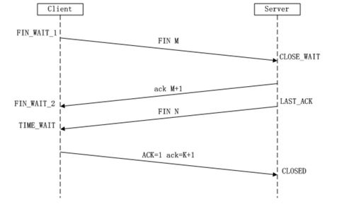

# Lab3-1: UDP reliable service - stop-and-wait

利用数据报套接字在用户空间实现面向连接的可靠数据传输，功能包括：建立连接、差错检测、接收确认、超时重传等。流量控制采用停等机制，完成给定测试文件的传输。

## Protocol Design

- UCP 传输协议
- 一个 server，一个 client
- 三次握手和四次挥手建立连接
- 编写头文件 `udp.h` 定义数据包及其头部的类
- 单向数据传输：client 发送数据，server 返回确认
  - 设置最大文件大小 `Max_filesz` = 20MB，超过则会传输失败
  - 停等机制，client 收到响应才会继续发送
  - 超时重传
  - 差错检测，错误则重传

### Packet

在头文件 `udp.h` 中实现，主要包括了 header 和 packet 的数据结构，还有一些操作函数：  

header 的成员有 packet **数据部分**的长度 `datasize`，校验和 `sum`，属性标志 `flag`，序列号 `seq` 和响应号 `ack`。  
其中，flag 包含的属性有：`END, START, OVER, FIN, ACK, SYN`，`SYN` 和 `FIN` 分别用于建立和关闭连接，`ACK` 表示响应，`START` 和 `OVER` 表示一个文件的开始和结束，`END` 表示数据传输完毕。  
另外，定义了 header 的初始化和赋值函数，以及查询 flag 是否**包含**某个字段的函数。

```c++
class Header
{
public:
    uint16_t datasize = 0;
    uint16_t sum = 0;
    uint16_t flag = 0; // END START OVER FIN ACK SYN
    uint16_t ack = 0;
    uint16_t seq = 0;
    Header(){}
    Header(uint16_t datasize, uint16_t sum, uint16_t flag, uint16_t ack, uint16_t seq) : datasize(datasize),sum(sum),flag(flag),ack(ack),seq(seq){}
    void set(uint16_t datasize, uint16_t sum, uint16_t flag, uint16_t ack, uint16_t seq);
    bool isSYN();
    bool isACK();
    bool isFIN();
    bool isOVER();
    bool isSTART();
    bool isEND();
};
```

packet 的成员有 header 和一个存储数据的字符数组，定义其长度为 `MAX_LENGTH`= 4KB。  
定义了 packet 的初始化和赋值函数。

```c++
class Packet
{
public:
    Header header;
    char buffer[MAX_LENGTH] = "";
    Packet(){}
    Packet(Header& header) : header(header){}
    void set(Header& _header, char* data_segment, int size){
        header = _header;
        memcpy(buffer, data_segment, size);
    }
};
```

最后，定义了两个函数：  
计算校验和的函数 `check_sum`；对已有校验和的包，它还可以通过检查计算结果是否为 0 确认校验和的正确性；  

```c++
uint16_t check_sum(uint16_t* pa, int size){
    int count = (size+1)/2;
    uint16_t* buf = (uint16_t*)malloc(size);
    memset(buf, 0, size);
    memcpy(buf, pa, size);
    unsigned long sum = 0;
    while(count--){
        sum += *buf++;
        if (sum & 0xffff0000) {
            sum &= 0xffff;
            sum++;
        }
    }
    return ~(sum & 0xffff);
}
```

打印 packet 信息的函数 `print_log`。

### Connect & Disconnect

通过三次握手和四次挥手完成连接，分别在 server 和 client 中实现：  


- 第一次握手：client 将 packet 标志位置为 `SYN`，seq=0xFFFF(-1)，发送给 server；
- 第二次握手：server 将标志位置为 `SYN` 和 `ACK`，seq=0xFFFF，ack=0，发送给 client；
- 第三次握手：client 将标志位置为 `ACK`，seq=0，ack=0，发送给 server。



- 第一次挥手：client 将 packet 标志位置为 `FIN`，seq=0xFFFF(-1)，发送给 server；
- 第二次挥手：server 将标志位置为 `ACK`，seq=0，ack=0，发送给 client；
- 第三次挥手，server 将标志位置为 `FIN` 和 `ACK`，seq=0xFFFF(-1)，发送给 client；
- 第四次握手，client 将标志位置为 `ACK`，seq=0，ack=0，发送给 server。

具体实现上，主要问题在阻塞：因为建立和关闭连接时都是 client 先发起，server 起初需要先在一个 while 循环里不断接收消息，直到接收了 client 发来的信息，才能往下执行；另外，在接收带有 `ACK` 字段的响应信息时，都要设置超时重传。

```c++
bool Connect()
{
    // 以建立连接的第一次握手为例，server 需要循环接收消息
    while(1){
        res = recvfrom(ServerSocket, connect_buf, packet_length, 0, (SOCKADDR*)&ClientAddr, &ClientAddrSize);
        if(res == SOCKET_ERROR){
            cout<<"first handshake failed."<<endl;
            return 0;
        }
        memcpy(&connect, connect_buf, packet_length);
        if((connect.header.flag == SYN) && (connect.header.seq == 0xFFFF) && check_sum((uint16_t*)&connect, packet_length)==0){
            cout<<"first handshake finished."<<endl;
            break;
        }
    }
    //other codes
    clock_t start = clock(); // 发送第二次握手后记录时间
    // 同样以此处的第三次握手为例，接收的是对第二次握手的响应
    while(recvfrom(ServerSocket, connect_buf, packet_length, 0, (SOCKADDR*)&ClientAddr, &ClientAddrSize)<=0){
        if(clock()-start > Max_time){ // 设定超时重传
            cout<<"second handshake timed out. Resending..."<<endl;
            res = sendto(ServerSocket, connect_buf, packet_length, 0, (SOCKADDR*)&ClientAddr, ClientAddrSize);
            if(res == SOCKET_ERROR){
                cout<<"second handshake failed."<<endl;
                return 0;
            }
            start = clock(); // 重置时间
        }
    }
    cout<<"second handshake finished."<<endl; // 接收到第三次握手后，第二次握手才能确定完成
    //other codes
}
```

## Client

client 从建立到关闭的整个流程如下：

1. 建立 socket，绑定端口和 IP；
2. 进入 `Connect` 函数，三次握手建立连接；
3. 开始数据传输：
   1. 用户输入文件名；
      - 如果是 quit 指令，就发送一个 `flag` 为 `END` 的包给 server 告知对方传输结束，跳出；
      - 如果是文件名，就进入下一步；
   2. 进入`sendfile` 函数，发送文件；
   3. 记录发送文件前后的时间，打印传输用时和平均吞吐率；
   4. 循环上述步骤。
4. 进入 `Disconnect` 函数，四次挥手关闭连接；
5. 关闭 socket，打印退出消息，结束。

其中，连接的建立和关闭在上文已经阐述过，这里只说明发送文件的过程。

发送一个文件，就是首先发送带有 `START` 字段、内容是文件名的第一个 packet，然后将文件拆成若干个 packet 顺序发送出去，最后一个要加上 `OVER` 字段。  
函数的主体内容如下：  

```c++
void send_file(string filename)
{
    // prev codes 根据传入的文件名将文件读入字符数组 file_buf
    // 第一个包，内容是文件名
    Header send_header;
    Packet send;
    send_header.set(name_sz, 0, START, 0, seq_num);
    send.set(send_header, name, name_sz);
    send.header.sum = check_sum((uint16_t*)&send, packet_length);
    
    int packet_num = size/MAX_LENGTH + 1; // 计算需要多少个包
    //print info
    send_packet(send); // 发送第一个包
    
    //按顺序发送所有的包
    for(int idx=0; idx < packet_num; idx++){
        if(idx == packet_num-1){ // 最后一个包，要标记OVER，另外注意包的大小
            send_header.set(size - idx * MAX_LENGTH, 0, OVER, 0, seq_num);
            send.set(send_header, file_buf + idx * MAX_LENGTH, size - idx * MAX_LENGTH);
            send.header.sum = check_sum((uint16_t*)&send, packet_length);
        }
        else{
            send_header.set(MAX_LENGTH, 0, 0, 0, seq_num);
            send.set(send_header, file_buf + idx * MAX_LENGTH, MAX_LENGTH);
            send.header.sum = check_sum((uint16_t*)&send, packet_length);
        }
        send_packet(send);
    }
    // other codes
}
```

为发送 packet 编写了单独的函数 `send_packet`，实现停等机制：发送之后，要等待直至收到 server 的响应、而且验证无误才能继续；如果超时仍未收到或存在错误就重发，继续等待响应。

```c++
void send_packet(Packet& pa)
{
    Packet recv;
    char* send_buf = new char[packet_length];
    char* recv_buf = new char[packet_length];
    memcpy(send_buf, &pa, packet_length);
    int res = sendto(ClientSocket, send_buf, packet_length, 0, (SOCKADDR*)&ServerAddr, ServerAddrSize);
    if(res == SOCKET_ERROR){
        cout<<"send error."<<endl;
    }
    clock_t start = clock();
    //print info
    while (1){
        while(recvfrom(ClientSocket, recv_buf, packet_length, 0, (SOCKADDR*)&ServerAddr, &ServerAddrSize)<=0){
            if(clock()-start > Max_time){ // 超时重发
                cout<<"timed out. resending..."<<endl;
                res = sendto(ClientSocket, send_buf, packet_length, 0, (SOCKADDR*)&ServerAddr, ServerAddrSize);
                if(res == SOCKET_ERROR){
                    cout<<"send error."<<endl;
                }
                start = clock();
                //print info
            }
        }
        memcpy(&recv, recv_buf, packet_length);
        if(recv.header.flag == ACK && recv.header.ack == pa.header.seq+1 && check_sum((uint16_t*)&recv, packet_length)==0){
            //print info
            seq_num++;
            break;
        }
        else { // 错误重发
            res = sendto(ClientSocket, send_buf, packet_length, 0, (SOCKADDR*)&ServerAddr, ServerAddrSize);
            if(res == SOCKET_ERROR){
                cout<<"send error."<<endl;
            }
            start = clock();
            // print info
        }
    }
    // other codes
}
```

## Server

server 从建立到关闭的整个流程和 client 基本一致，唯一区别是发送文件变为接收文件。  

用于接收单个文件的函数 `recv_file` 循环接收从 `START` 到 `OVER` 的所有 packet，每收到一个，首先检查有无错误，有则直接丢弃，没有再根据 `flag` 字段分别处理，将 packet 内数据写入字符数组 `file_content` 里，最后再统一写入创建的文件中；为确定当前 packet 写入的位置，维护一个 `offset` 变量，每次增加所收到 packet 的数据长度，文件全部传输完毕后就得到了文件大小。

```c++
void recv_file(){
    char* file_content = new char[Max_filesz];
    string filename = "";
    long offset = 0; // 当前文件偏移
    int res;
    while(1){
        char* recv_buf = new char[packet_length];
        Packet recv;
        res = recvfrom(ServerSocket, recv_buf, packet_length, 0, (SOCKADDR*)&ClientAddr, &ClientAddrSize);
        if(res == SOCKET_ERROR){
            cout<<"recv error."<<endl;
        }else {
            memcpy(&recv, recv_buf, packet_length);
            // 检查有无错误，若有则直接将该数据包丢弃
            // 不是重传，也不是下一个
            if(check_sum((uint16_t*)&recv, packet_length)!=0 || (recv.header.seq!=seq_num && recv.header.seq!=seq_num+1)){
                cout<<"something is wrong with this packet. waiting for resend."<<endl<<endl;
                continue;
            }
            // 第一个包，内容是文件名
            if(recv.header.isSTART()){
                filename = recv.buffer;
                //print info
                send_ack(recv);
                //seq_num++;
            }
            // 最后一个包，这个文件全部发送完毕
            else if(recv.header.isOVER()){
                memcpy(file_content + offset, recv.buffer, recv.header.datasize);
                offset += recv.header.datasize;
                //print info
                ofstream fout(output_dir + filename, ofstream::binary); // 写入输出文件
                fout.write(file_content, offset);
                fout.close();
                send_ack(recv);
                //other codes
                break;
            }
            // client 结束连接
            else if(recv.header.isEND()){
                quit = true;
                //other codes
                break;
            }
            // 文件发送中
            else {
                if(recv.header.seq == seq_num+1) seq_num++;
                memcpy(file_content + offset, recv.buffer, recv.header.datasize);
                offset += recv.header.datasize;
                //other codes
                send_ack(recv);
                //seq_num++;
            }

        }
        delete[] recv_buf;
    }
    seq_num = 0; // 每次收到一个文件就置零
    delete[] file_content;
}
```

收到一个 packet，就要发回一个响应。定义函数 `send_ack` 如下：  

```c++
void send_ack(Packet& recv){
    Packet pa_ack;
    char* buf = new char[packet_length];
    pa_ack.header.set(0, 0, ACK, recv.header.seq+1, seq_num); // 响应号是所响应的包的序列号+1
    pa_ack.header.sum = check_sum((uint16_t*)&pa_ack, packet_length);
    memcpy(buf, &pa_ack, packet_length);
    int res = sendto(ServerSocket, buf, packet_length, 0, (SOCKADDR*)&ClientAddr, ClientAddrSize);
    if(res == SOCKET_ERROR) cout<<"send ack failed."<<endl;
    else{
        //print info
    }
    delete[] buf;
}
```

## Usage and Effect

首先打开 server，然后打开 client，建立连接：


传输一个很小的文件，展示文件传输的全过程：


传输一个较大的文件，查看传输时间和吞吐率：


输入 quit 结束传输，关闭连接并退出：


测试传输文件 `1.jpg, 2.jpg, 3.jpg, helloworld.txt`，正确。